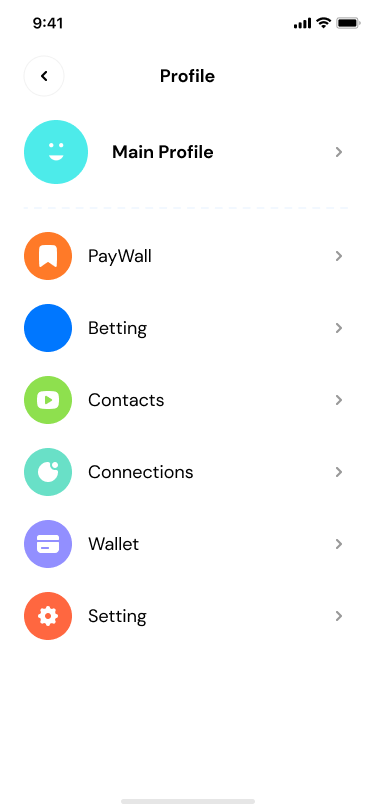

# Profile

To start working with MetaTower, you must first create your profile. All you have to do is enter the wallet address and fill in the rest of the fields is optional. MetaTower offers a new solution for verifying your account. $Tokens intends to implement a non-exploitable online reputation system based on TrustDavis (DeFigueiredo and Barr 2005, DeFigueiredo and Barr 2009). Stakeholders can deposit MTT against usernames at a premium, creating a badge indicating a level of value that username holds and the number of backers they have.\

But for a more effective connection, you can also choose a photo for your profile. Choose any nickname you like, and to have better offers and more effective communication, determine if you are a business owner or investor. It is also optional to enter your contact number and email, but joining each has advantages described in the Reputation section.
