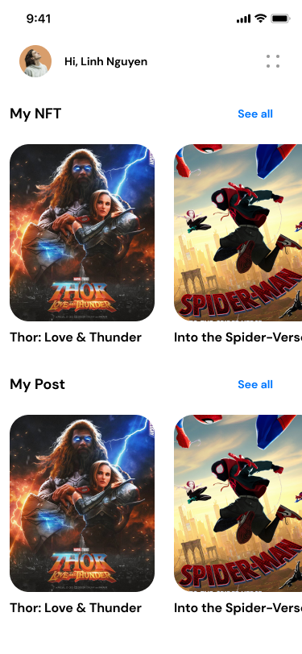

# What is pay-wall

Each user has a personal space in Meta tower that others must pay to visit. This space called Pay-wall, contains posts and NFTs for each profile. In addition, people with this payment can also visit the person's profile.

Each person introduces themselves, how to communicate with themselves, NFT and non-NFT products through Paywall. Users who produce content products can share some of their products for free to display and attract users to their paywall. All posts and products will be priced by the user. The user decides what each type of communication is and how much it costs the user to communicate with them. In this section, the user shares the groups and channels he has created with a complete description for the users. Each user can also subscribe to this section and become a member of user groups and channels.
