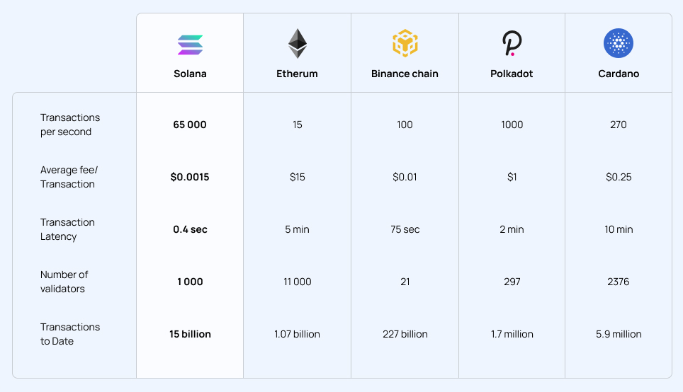

# Why Solana(Or serum)?


**Good to know:** One of the most critical issues in setting up a small business platform is to create the proper infrastructure to transfer money with the lowest fees and high speed, which is possible through the Solana platform.


## Solana network

While the 2020 DeFi summer hinged on Ethereum as the primary driver, 2021 saw the rise of other layer-one protocols like Solana that promised higher transaction speeds at lower costs.

**Proof of history:** To decrease communication cost and latency, Solana’s Proof of Stake (PoS) based consensus method, termed Tower BFT, [uses the network’s Proof of History (PoH)](https://www.leewayhertz.com/solana-blockchain-using-poh/) approach as a reminder before consensus.

**NFT Support**: Focus on the artwork, not writing a new smart contract. The Solana NFT standard and minting program offers extreme customizability with ecosystem-wide support.&#x20;

**The lowest fees,**[ **DeFi**](https://www.investopedia.com/decentralized-finance-defi-5113835) **made fast**: Defi ecosystems require rapid development, transfer speed, and independent management, all present in the Solana network. Each transaction on Solana costs a fraction of a cent. Also, about speed, Solana comes to consensus and finality almost immediately — no long wait times like other blockchains.&#x20;

**Capture new revenue:** Settle payments in milliseconds instead of days and immediately earn a high yield on your USD stablecoins. [Banks aren't on the blockchain](https://assets.website-files.com/61382d4555f82a75dc677b6f/61384a6d5c937269dbed185c\_serum\_white\_paper.88d98f84.pdf), and neither are physical dollar bills. So how do you build a stable coin that is always worth a dollar and doesn't rely on a bank account not getting shut down?

**Incentivize your customers**: Share the incremental value with customers with on-chain rewards and loyalty offerings.

A Proof of Stake ([PoS](https://www.fool.com/investing/stock-market/market-sectors/financials/cryptocurrency-stocks/proof-of-stake/)) (i.e., using the in-protocol asset, SOL, to provide secure consensus) design is outlined here. Solana implements a proof of stake reward/security scheme for validator nodes in the cluster. The purpose is threefold:

&#x20;Align validator incentives with the more excellent cluster through skin-in-the-game deposits at risk.

* Align validator incentives with that of the more excellent cluster through skin-in-the-game deposits at risk.
* Avoid 'nothing at stake' fork voting issues by implementing slashing rules to promote fork convergence.
* Provide an avenue for validator rewards provided as a function of validator participation in the cluster.
* **Own your relationships:** Remove intermediaries. Become a merchant that works directly with your customer. [Metaplex](https://www.metaplex.com) empowers creators and brands to build a direct relationship with their audiences. Start your own NFT storefront in minutes with Metaplex. Mint, sell, and host auctions all in one customizable frontend.
